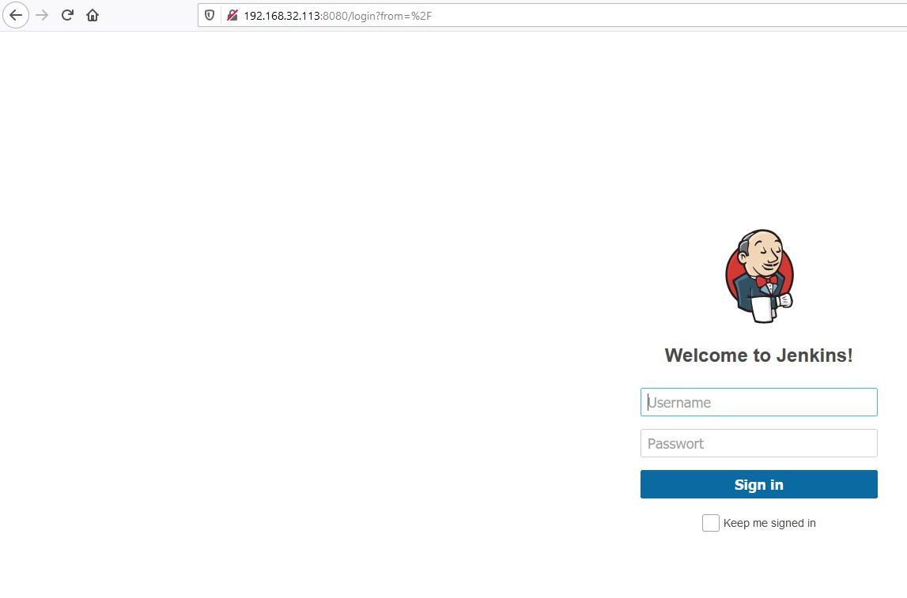

<h1> Prerequisites </h1>

- install ansible 
- install vagrant


<h1> Start </h1>

Change into the directory where the vagrantfile is located and start vagrant

``` 
vagrant up 
```

To stop the boxes use

``` 
vagrant halt 
```

To reboot the boxes use

``` 
vagrant reload 
```

And to kill the boxes use

``` 
vagrant destroy
```

When the vagrant boxes are initialized and running, you are able to run the playbook 

``` 
ansible-playbook -i inventory/inventory playbook/playbook.yml
```

After the playbook was running successfully, you are able to connect to your Jenkins server. Therefore, type http://192.168.32.113:8080 into your browser 




You can use the following credentials to sign in to Jenkins

User: Admin

Password: Admin